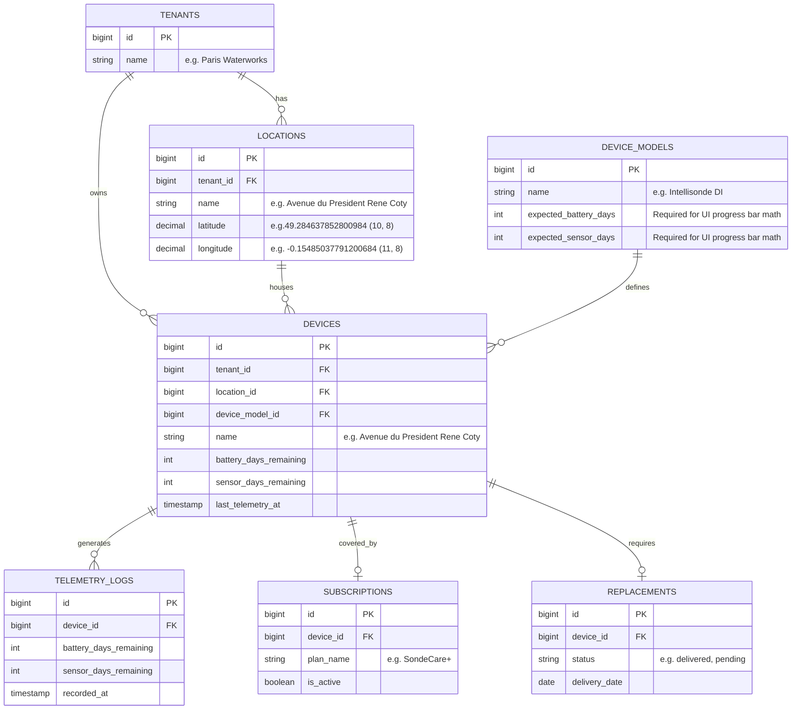

# Entity Relationship Diagram

```mermaid
erDiagram
    TENANTS ||--o{ LOCATIONS : has
    TENANTS ||--o{ DEVICES : owns
    LOCATIONS ||--o{ DEVICES : houses
    DEVICE_MODELS ||--o{ DEVICES : defines

    DEVICES ||--o{ TELEMETRY_LOGS : generates
    DEVICES ||--o| SUBSCRIPTIONS : covered_by
    DEVICES ||--o| REPLACEMENTS : requires

    TENANTS {
        bigint id PK
        string name "e.g. Paris Waterworks"
    }
    DEVICE_MODELS {
        bigint id PK
        string name "e.g. Intellisonde DI"
        int expected_battery_days "Required for UI progress bar math"
        int expected_sensor_days "Required for UI progress bar math"
    }
    LOCATIONS {
        bigint id PK
        bigint tenant_id FK
        string name "e.g. Avenue du President Rene Coty"
        decimal latitude "e.g.49.284637852800984 (10, 8)"
        decimal longitude "e.g. -0.15485037791200684 (11, 8)"
    }
    DEVICES {
        bigint id PK
        bigint tenant_id FK
        bigint location_id FK
        bigint device_model_id FK
        string name "e.g. Avenue du President Rene Coty"
        int battery_days_remaining
        int sensor_days_remaining
        timestamp last_telemetry_at
    }
    TELEMETRY_LOGS {
        bigint id PK
        bigint device_id FK
        int battery_days_remaining
        int sensor_days_remaining
        timestamp recorded_at
    }
    SUBSCRIPTIONS {
        bigint id PK
        bigint device_id FK
        string plan_name "e.g. SondeCare+"
        boolean is_active
    }
    REPLACEMENTS {
        bigint id PK
        bigint device_id FK
        string status "e.g. delivered, pending"
        date delivery_date
    }
```
